#  Generating Full-field Evolution of Physical Dynamics from Irregular Sparse Observations
<div align=center>  </div>
(This repo is still on update)

This is authors' official PyTorch implementation for paper:"**Generating Full-field Evolution of Physical Dynamics from Irregular Sparse Observations**"[[Arxiv](https://arxiv.org/pdf/2505.09284)].


---
## Key Idea
Generating ***Continous Spatiotemporal Multidimensional Physical Data*** with Functional Tucker Model, GP-based Sequential Diffusion and Message-Passing Posterior Sampling.


<!-- <!-- <div align=center>  </div> -->

<div align=center> 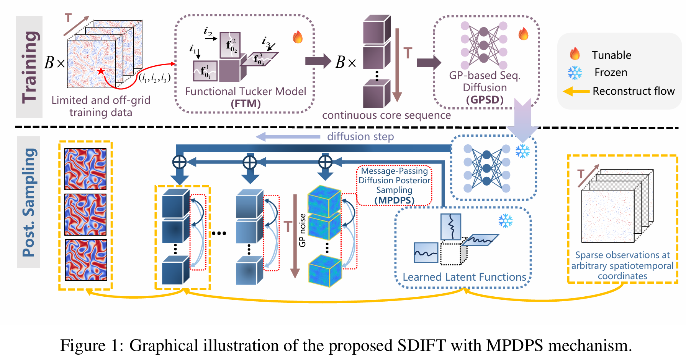 </div>

### Functional Tucker Model (FTM)
<div align=center> 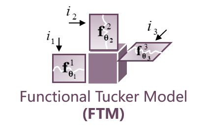 </div>
FTM is a general framework that naturally captures the inherent multi-dimensional structure 
of physical fields and provides compact representations well-suited for sparse or irregular 
scenarios. 


### Gaussion Process-based Sequential Diffusion  (GPSD)
<div align=center> 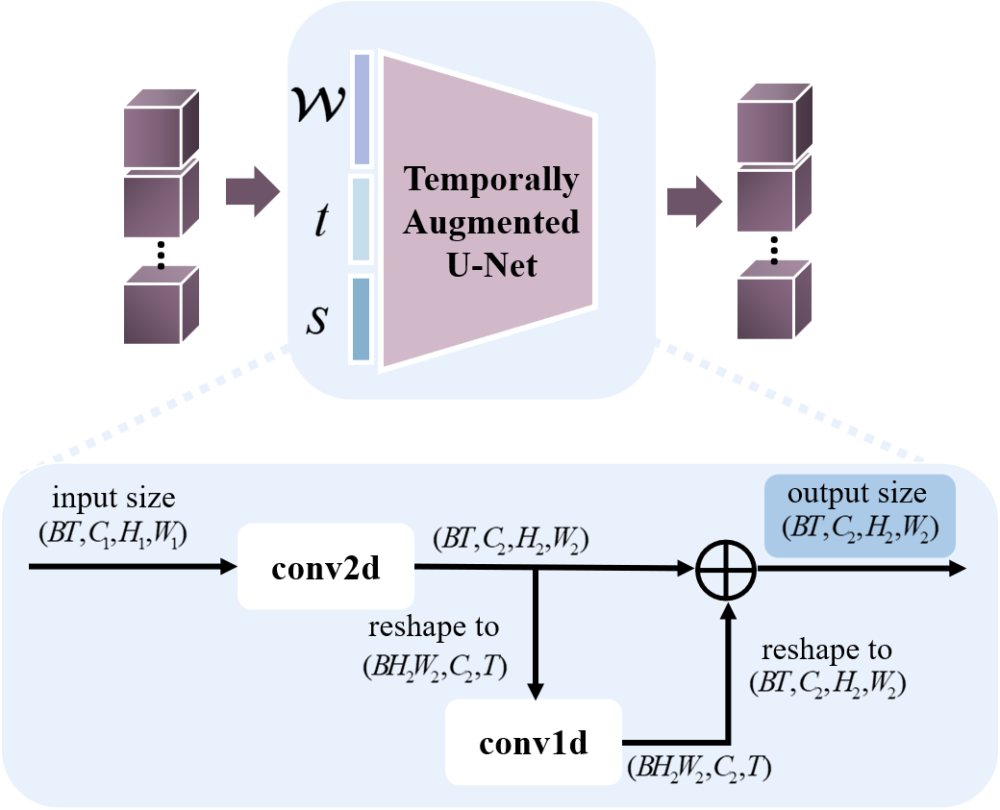 </div>

GPSD is a variant of diffusion models that uses a Gaussian Process (GP) as the noise source to better capture temporal continuity. Specifically, we design a new architecture called the **Temporally-Augmented U-Net** to serve as the denoiser. 


### Message-Passing Diffusion Posterior Sampling (MPDPS)
<div align=center> 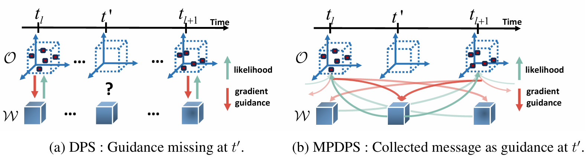 </div>

MPDPS **leverages the temporal continuity inherent in physical dynamics and propagates observation-derived guidance across the entire core sequence** using Gaussian Process Regression (GPR). For cores at timesteps with direct observations, this guidance is further refined through messages from neighboring observed timesteps. This smoothing mechanism enhances the robustness of the generated sequence, especially under noisy or extremely sparse observations.


---

## Quick Snapshot of Reconstruction Results on Acttive Matter dataset: 

### Ground Truth:
<div align=center>
  
</div>


### Sampling Pattern for Observation Setting 1 (Consistently 1% Observation Rate across All Timesteps):
<div align=center> 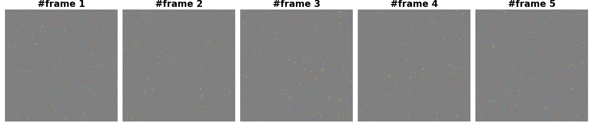 </div>


#### Reconstruction Results on Observation Setting 1
<table>
<tr>
  <td align="center">
    <br>
    <sub>A:SDIFT + MPDPS (clean observation)</sub>
  </td>
  <td align="center">
    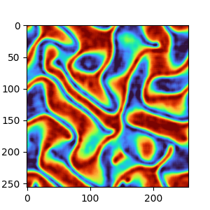<br>
    <sub>B:SDIFT + DPS (clean observation)</sub>
  </td>
  <td align="center">
    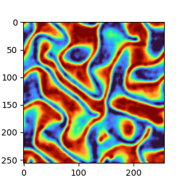<br>
    <sub>C:SDIFT + MPDPS (noisy observation)</sub>
  </td>
  <td align="center">
    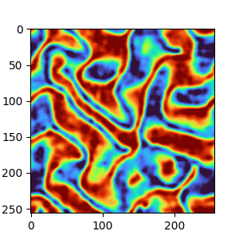<br>
    <sub>D:SDIFT + DPS (noisy observation)</sub>
  </td>
</tr>
</table>
Animations A and B show SDIFT with MPDPS and DPS reconstructions, respectively, using clean observations.
Animations C and D present the same reconstructions under severe noise conditions.

- All cases demonstrate the ability to reconstruct the approximate structure of the physical field from highly sparse observations, thanks to the FTM encoder, which significantly reduces the number of unknown variables (i.e., the elements of the core tensor).
- One can see that our proposed MPDPS ***significantly improves both qualitative and quantitative reconstruction results—the evolution of the physical field is much smoother—and demonstrates strong robustness against noise.***


### Sampling Pattern for Observation Setting 2  (1% Observation Rate across Interlaced Timesteps):
<div align=center> 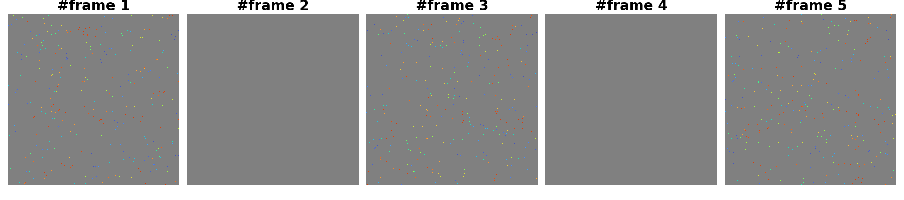 </div>


#### Reconstruction Results on Observation Setting 2


<table align="center">
  <tr>
    <td align="center">
      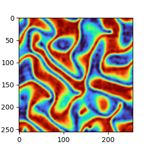<br>
      A:SDIFT + MPDPS (clean observation)
    </td>
    <td align="center">
      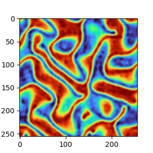<br>
      B:SDIFT + DPS (clean observation)
    </td>
  </tr>
</table>

It is obvious that, unlike DPS which generates non-smooth animations, MPDPS consistently produces accurate and smooth reconstructions, even at timesteps lacking direct observations, demostrating the effectivenness of our proposed method.


------------------

<!-- Example of latent functions of spatial and temporal modes learned from real-world data.
<div align=center>  </div>
<div align=center>  </div> -->

## Requirements:
The project is mainly built with **pytorch 2.3.0** under **python 3.10**. The detailed package info can be found in `requirement.txt`.

## Instructions:
1. Clone this repository.
2. To play with the model quickly, we offer several notebooks at `notebook`(on activate matter data)
3. The project primarily consists of three `.py` files, **which should be executed in the following order:** 

- **`train_FTM.py`**  
  Trains the Functional Tucker Model using physical data and outputs shared latent functions along with batches of core tensors.

- **`train_GPSD.py`**  
  Trains the GP-based Sequential Diffusion Model using the batches of core tensors obtained from the first step.

- **`message_passing_DPS.py`**  
  Reconstructs the entire field from sparse observations using our proposed Message-Passing DPS algorithm.


4. Tune the (hyper)parameters of model in the corresponding `.py` file.
5. To apply the model on your own dataset, please follow the  `preprocessing_data.py` file to process the raw data into appropriate format.
6. GPU choice: the models are run on CPU by default, but you can change the device to CPU by modifying the `device` in the correponding file


<!-- ## Data

We offer the **raw data**,  **processed data** and **processed scripts** for all three datasets used in paper. Given the large size of  *Solar-Power* and *Uber-Move*, we put them in the [google drive](https://drive.google.com/drive/folders/1KtxKwGaUAFnKWXwjUzjZ64hmYlda2Qtl?usp=sharing).

- Traffic-Guangzhou: [raw data](https://github.com/xuangu-fang/BayOTIDE/blob/master/data/raw/tensor.mat), [processed scripts](https://github.com/xuangu-fang/BayOTIDE/blob/master/data/process_script/data_process_guangzhou.ipynb), and [processed data](https://github.com/xuangu-fang/BayOTIDE/tree/master/data/guangzhou) 

- Solar-Power: [raw data](https://drive.google.com/drive/folders/1KtxKwGaUAFnKWXwjUzjZ64hmYlda2Qtl?usp=sharing), [processed scripts](https://github.com/xuangu-fang/BayOTIDE/blob/master/data/process_script/data_process_solor.ipynb), and [processed data](https://drive.google.com/drive/folders/1KtxKwGaUAFnKWXwjUzjZ64hmYlda2Qtl?usp=sharing) 

- Uber-Move: [raw data](https://drive.google.com/drive/folders/1KtxKwGaUAFnKWXwjUzjZ64hmYlda2Qtl?usp=sharing), [processed scripts](https://github.com/xuangu-fang/BayOTIDE/blob/master/data/process_script/data_process_uber.ipynb), and [processed data](https://drive.google.com/drive/folders/1KtxKwGaUAFnKWXwjUzjZ64hmYlda2Qtl?usp=sharing) 


The code for generating the synthetic data is also provided in the [notebook]( https://github.com/xuangu-fang/BayOTIDE/blob/master/data/process_script/gen_simu.ipynb).


If you wanna customize your own data to play the model, please follow the notebooks in `data/process_script/`. -->


## Citing SDIFT
> 🌟 If you find this resource helpful, please consider to star this repository and cite our research:
```tex
@misc{chen2025SDIFT,
      title={Generating Full-field Evolution of Physical Dynamics from Irregular Sparse Observations}, 
      author={Panqi Chen and Yifan Sun and Lei Cheng and Yang Yang and Weichang Li and Yang Liu and Weiqing Liu and Jiang Bian and Shikai Fang},
      year={2025},
      eprint={2505.09284},
      archivePrefix={arXiv},
      primaryClass={cs.LG},
      url={https://arxiv.org/abs/2505.09284}, 
}
```
In case of any questions, bugs, suggestions or improvements, please feel free to open an issue.